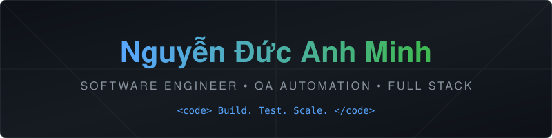

<h1 align="center">
  
</h1>

  

## Overview

  Software Engineer & QA Automation Expert focused on building high-quality automation frameworks, scalable backend systems, and clean architecture.

  Developing robust testing solutions with Playwright, Gherkin syntax, and OOP principles, alongside full-stack applications and automated data processing pipelines.

  

## Tech Stack

  
  
  
  
  
  
  
  

  
  
  
  
  
  

  

## Telemetry & Metrics

  
  
  
  
  
  
  
  

  

  
  

  

  

  

## Connect

  
  

 

  <em style="color:#C7A54A;">Thanks for stopping by Ò_ó</em>

  

  

