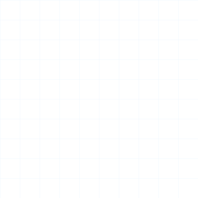

  

<h1 align="center">Hi there 👋, I'm Nguyễn Đức Anh Minh</h1>
<h3 align="center">Software Engineer | QA Automation Engineer | Full Stack Developer</h3>

  I am a Software Engineering student passionate about building modern software products and high-quality automation frameworks. I believe software quality must be built into every stage of development, from architecture design to automated testing and CI/CD pipelines.

  

  

  

## 🎯 Career Vision
I aspire to become a versatile Software Engineer with strong expertise in **Automation Engineering, Backend Development, and Software Architecture**. My goal is to build reliable, scalable systems while promoting uncompromising quality through automation, clean engineering practices, and optimized data pipelines.

## 🛠 Core Expertise & Tech Stack

**Backend & Architecture**

  
  
  
  
  

**QA Automation & DevOps**

  
  
  
  

**Frontend & Database**

  
  
  
  
  
  

  

## 🚀 Featured Projects

### 🥇 [SoundMates](#)
*An AI-powered platform for discovering, creating, and joining live music experiences.*
* **Architecture:** Microservices, Event-driven communication (RabbitMQ), Real-time interaction.
* **Responsibilities:** Designed the system architecture and database schema, developed backend services and REST APIs, and implemented robust authentication/authorization. 
* **Specialized Integrations:** Engineered backend logic capable of handling complex audio data workflows, scalable live session management, and payment integrations.
* **Tech Stack:** ASP.NET Core, React / Next.js, PostgreSQL, Redis, RabbitMQ, Docker.

### 🥈 [Playwright Hybrid Automation Framework](#)
*Enterprise-ready automation framework for UI and API testing.*
* **Features:** Built using the Page Object Model (POM), supporting Data-Driven Testing, BDD, and parallel execution. Designed with a CI-ready architecture for seamless GitHub Actions integration.
* **Advanced Implementations:** Developed custom utilities for JSON locator management and utilized advanced prompt engineering to automatically generate Gherkin-standard automation test scenarios from structured JSON inputs.
* **Tech Stack:** Playwright, TypeScript, Cucumber, Node.js.

### 🥉 [LifeOS](#)
*An AI-powered personal productivity platform designed to manage life, work, and long-term knowledge.*
* **Features:** AI Memory & Assistant, Task/Calendar management, Habit tracking, and Finance management.
* **Responsibilities:** Led system architecture, backend/frontend development, and AI feature research to build a cohesive, long-term memory system.
* **Tech Stack:** Next.js, ASP.NET Core, PostgreSQL, Redis, Docker.

### 📂 Specialized & Utility Projects
* **REST API Automation Framework:** A reusable API framework supporting authentication, CRUD testing, response validation, and comprehensive reporting.
* **Automated Content Moderation Engine:** Developed Python-based toxicity check systems utilizing Google Cloud Speech-to-Text to analyze audio transcripts. Implemented dictionary-based regex filters and a strict "Red Zone" zero-tolerance policy for offensive content to automate the approval workflow for digital media.

  

## 🐍 GitHub Activity & Metrics

  <!-- Hình nền grid tùy chọn -->
  
  
  

    
    
  

  
  

    
    
  

  

